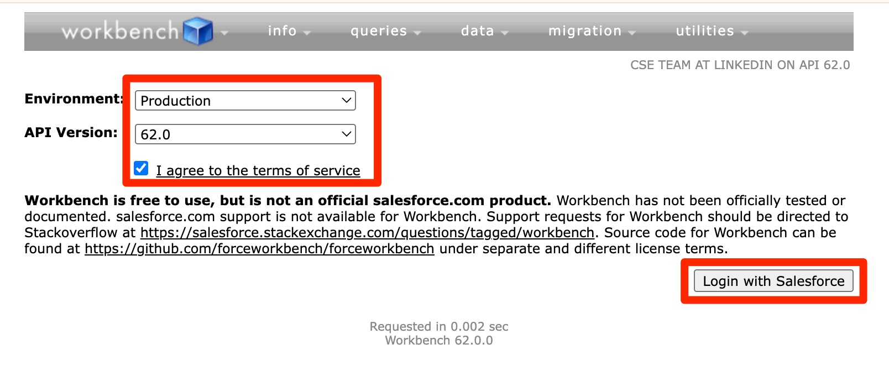
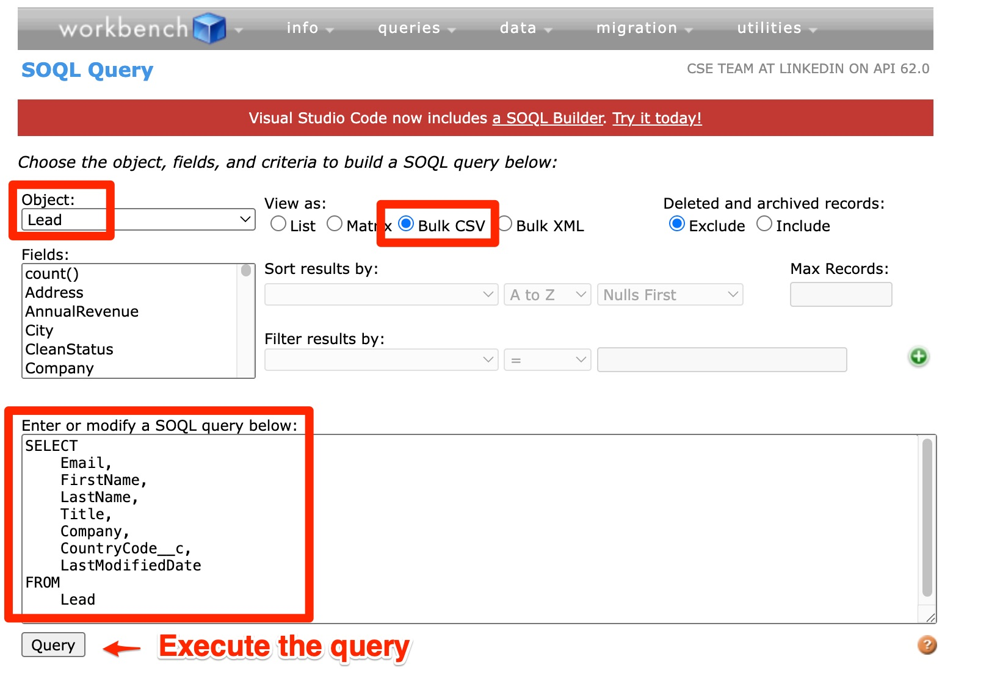
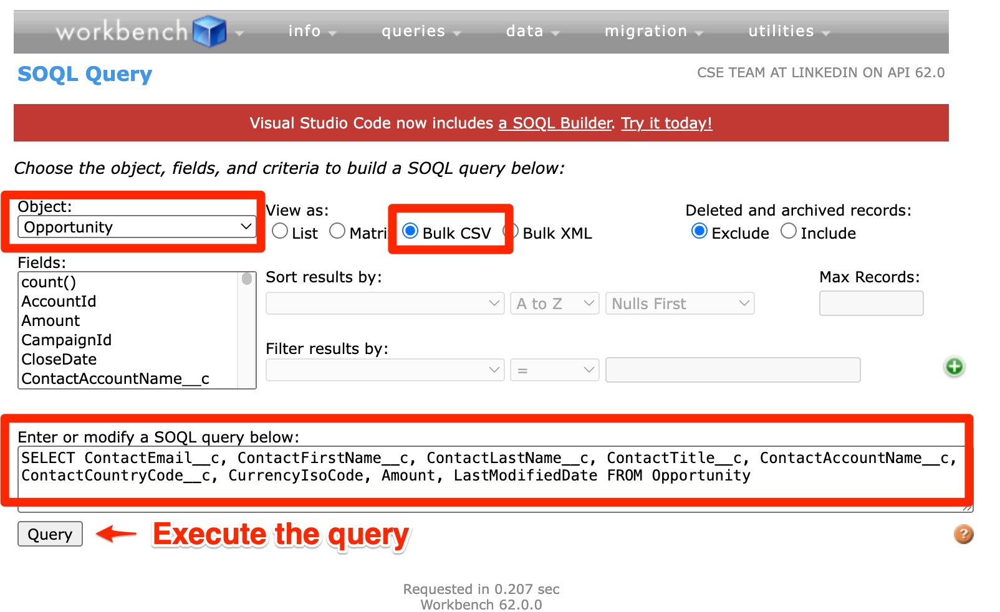
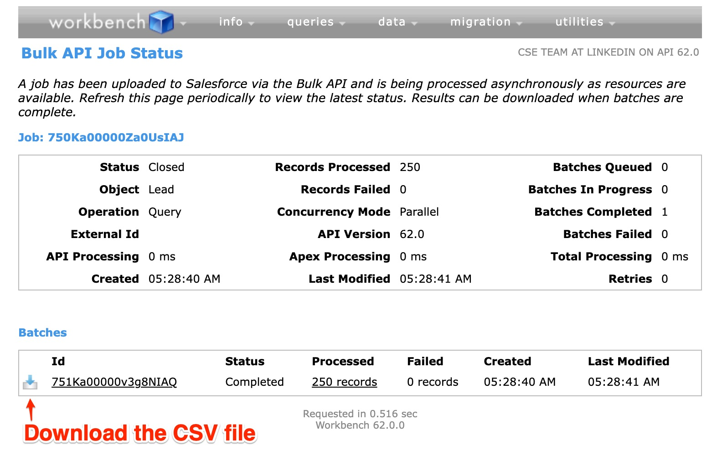
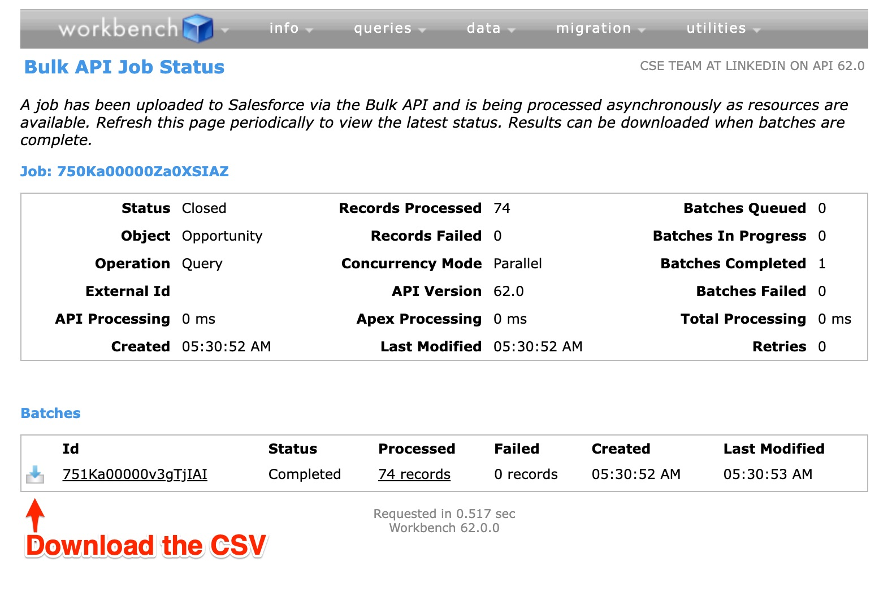
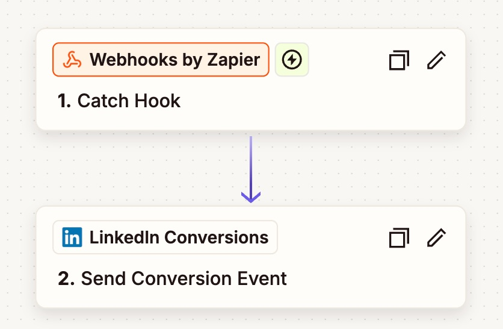
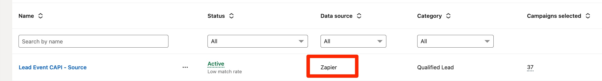
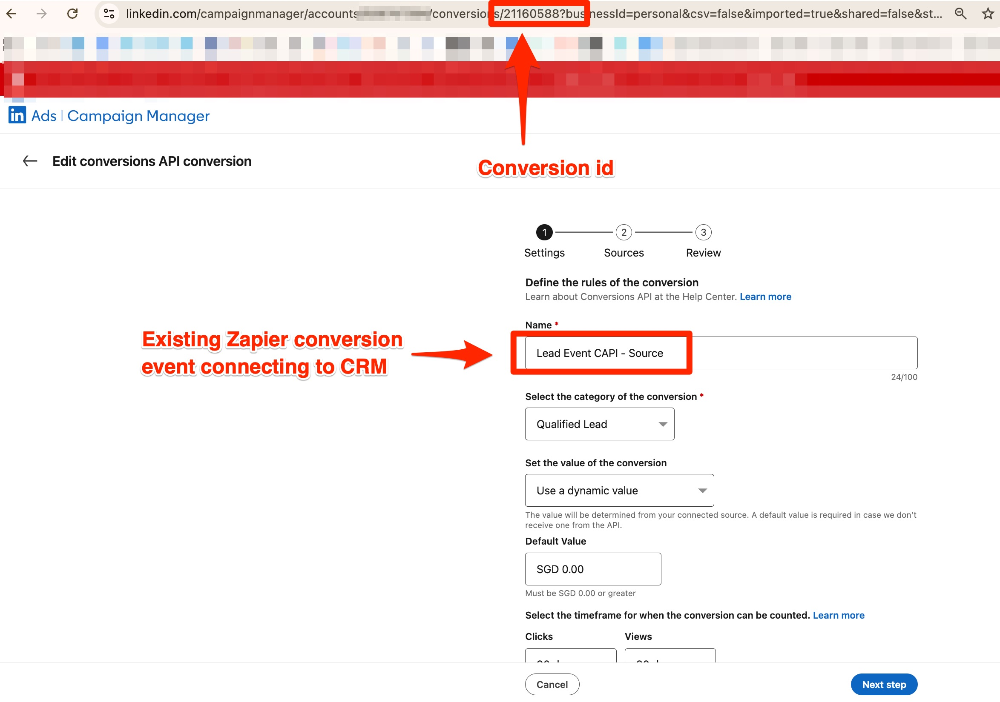

# Zapier CAPI Historical Event Sender

A comprehensive Node.js application that generates fake CSV data using the Faker.js library and sends the data to various endpoints including webhook URLs (like Zapier) and LinkedIn Conversions API (CAPI) with configurable rate limiting. This tool is perfect for testing webhook integrations, LinkedIn CAPI implementations, and simulating historical event data.

## Features

### Data Generation

- **Interactive Field Selection**: Choose from 8 different data fields
- **Mandatory Email Field**: Email is always included as it's required
- **Flexible Record Count**: Generate between 1 and 1,000,000 records
- **CSV Output**: Properly formatted CSV with headers
- **Progress Tracking**: Shows progress for large datasets
- **Timestamped Files**: Each generated file has a unique timestamp

### Webhook Sending

- **Interactive Webhook Configuration**: Configure webhook URL and rate limiting
- **CSV File Selection**: Browse and select from available CSV files in the directory
- **Rate Limiting**: Configurable requests per minute (20-25 RPM)
- **Progress Monitoring**: Real-time progress display with success/error tracking
- **Error Handling**: Comprehensive error logging and retry mechanisms
- **JSON Payload**: Automatically formats data according to webhook requirements

### LinkedIn CAPI Integration

- **LinkedIn API Configuration**: Support for different LinkedIn API versions (YYYYMM format)
- **Secure Authentication**: Access token management for LinkedIn API
- **Conversion Tracking**: Configurable conversion ID for event tracking
- **Historical Conversion Time**: Optional support for historical conversion timestamps (within last 90 days)
- **Email Hashing**: Automatic SHA-256 hashing of email addresses for privacy
- **High-Volume Processing**: Rate limiting (100-600 RPM) for bulk conversions
- **Concurrent Request Processing**: Optimized batch sending with 10 concurrent requests per batch
- **Performance Optimized**: 5-10x faster than sequential processing for large datasets
- **Detailed Analytics**: Comprehensive API response statistics and error reporting
- **CAPI Compliance**: Full LinkedIn Conversions API specification compliance

### Data Validation & Quality Control

- **Email Validation**: Ensures every record has a valid email address before processing
- **User Information Rules**: Enforces LinkedIn CAPI requirement that firstName and lastName must be present when sending any user information (title, company, country)
- **Historical Timestamp Management**: Interactive handling of conversion timestamps older than 90 days with options to reset or skip
- **Smart Record Filtering**: Automatically excludes invalid records with detailed explanations
- **Real-time Validation Feedback**: Shows exactly why records are skipped during processing
- **Comprehensive Reporting**: Detailed summary of sent, failed, and skipped records with success rates

## Available Data Fields

1. **email** - Email address (mandatory)
2. **firstName** - First name (optional)
3. **lastName** - Last name (optional)
4. **title** - Job title (optional)
5. **companyName** - Company name (optional)
6. **countryCode** - Country code (e.g., US, UK) (optional)
7. **currencyCode** - Currency code (e.g., USD, EUR) (optional)
8. **conversionValue** - Conversion value (numeric 1-1000) (optional)
9. **conversionTime** - Conversion time (epoch milliseconds, last 90 days) (optional)

## SFDC (Salesforce) Compatibility

This application now includes enhanced support for CSV files exported from Salesforce CRM via SFDC Workbench:

### Automatic Data Cleaning

- **Quote Removal**: Automatically strips surrounding quotes from field values (e.g., `"John Doe"` → `John Doe`)
- **Empty Value Handling**: Converts `"[not provided]"` to empty strings and excludes from payloads
- **ISO-8601 Conversion**: Automatically detects and converts ISO-8601 timestamps to epoch milliseconds
  - Example: `"2025-07-24T20:44:52.000Z"` → `1753389892000`

### Smart Field Filtering

- **LinkedIn CAPI**: Only includes fields with actual values in the event payload
- **Webhook Sender**: Excludes empty fields from JSON payload to reduce data size
- **Validation**: Ensures `conversionTime` values are within the last 90 days for LinkedIn CAPI compliance

### Data Validation and Quality Assurance

Both LinkedIn CAPI and Webhook senders include comprehensive validation logic to ensure data quality:

#### Required Field Validation

- **Email Requirement**: Every record must have a valid email address (assuming CRM data source)
  - Records without email are completely skipped
- **User Information Validation**: If any user information fields (title, companyName, countryCode) are provided, both firstName and lastName must be present
  - **Smart Field Exclusion**: When user information is incomplete (missing firstName/lastName), only the user information fields are excluded from the record
  - **Record Preservation**: The record is still sent with email and other valid fields (currencyCode, conversionValue, etc.)
  - **Clear Messaging**: Detailed warning explains which fields were excluded and why

#### Timestamp Handling for Historical Data

- **90-Day Rule**: LinkedIn CAPI requires conversion events to be within the last 90 days
- **Interactive Configuration**: When `conversionTime` is found in CSV, the application asks:
  - Whether to include conversion timestamps from CSV
  - For timestamps older than 90 days: Reset to current time or skip the event
- **Automatic Processing**:
  - If "reset" is chosen: Old timestamps are automatically updated to current time
  - If "skip" is chosen: Events with old timestamps are excluded with detailed explanations

#### Currency Data Validation

- **Paired Field Requirement**: `currencyCode` and `conversionValue` must both be present and valid, or both are ignored
- **Currency Code Format**: Must be a 3-character ISO currency code (e.g., USD, EUR, GBP)
- **Conversion Value Format**: Must be a valid number greater than or equal to zero
- **Smart Handling**:
  - If only one field is provided, both fields are ignored with a warning message
  - If currency code format is invalid, both fields are ignored
  - If conversion value is not a valid number or negative, both fields are ignored
  - Warnings are shown during processing but don't cause record rejection

#### Validation Reporting

- **Real-time Feedback**: Invalid records are skipped with clear explanations of why they failed validation
- **Comprehensive Summary**: Final report shows:
  - Successfully sent records
  - Failed records (with error details)
  - Skipped records (with validation reasons)
  - Overall success rate and processing statistics

### Supported SFDC Export Formats

Both Lead and Opportunity exports are supported with proper field mapping as described in the Data Preparation section.

## Data Preparation - How to export data from SFDC CRM to CSV file

Follow these steps to export data from Salesforce CRM and prepare it for use with this application:

### 1. Open SFDC Workbench

Navigate to [https://workbench.developerforce.com/login.php](https://workbench.developerforce.com/login.php)

- Select your environment
- Choose API version
- Login with your Salesforce credentials

  

### 2. Paste your Salesforce SOQL query

#### Lead Table example

```sql
SELECT
    Email,
    FirstName,
    LastName,
    Title,
    Company,
    CountryCode__c,
    LastModifiedDate
FROM
    Lead
```

**Note:** You can modify the above as appropriate. `LastModifiedDate` will export in ISO-8601 date time format.



#### Opportunity Table example

```sql
SELECT
    ContactEmail__c,
    ContactFirstName__c,
    ContactLastName__c,
    ContactTitle__c,
    ContactAccountName__c,
    ContactCountryCode__c,
    CurrencyIsoCode,
    Amount,
    LastModifiedDate
FROM
    Opportunity
```

**Note:** You can modify the above as appropriate. You need to "Activate Multiple Currencies" for your org in SFDC CRM to support currency ISO code.



### 3. Download the CSV file in SFDC Workbench

Execute your query and download the resulting CSV file.

Download the CSV file for Lead Query


Download the CSV file for Opportunity Query


### 4. Copy CSV files to current app directory

Move the downloaded CSV file to the directory where this application is located.

### 5. Replace the header row (1st row) in CSV with appropriate header labels

#### Lead CSV file

Replace the header row:

```
"Email","FirstName","LastName","Title","Company","CountryCode__c","LastModifiedDate"
```

with:

```
email,firstName,lastName,title,companyName,countryCode,conversionTime
```

#### Opportunity CSV file

Replace the header row:

```
"ContactEmail__c","ContactFirstName__c","ContactLastName__c","ContactTitle__c","ContactAccountName__c","ContactCountryCode__c","CurrencyIsoCode","Amount","LastModifiedDate"
```

with:

```
email,firstName,lastName,title,companyName,countryCode,currencyCode,conversionValue,conversionTime
```

## Prerequisites

- Node.js (version 18 or higher)
- npm (Node Package Manager)

### Assumptions

- You have created Zapier CAPI conversion connecting to your CRM (e.g. Salesforce) and the Zap is already live
- You need to send historical CAPI event (potentially 100k events) one-off to the same conversion, Zapier does not officially support sending historical events and there is a (restrictive API limit)[https://help.zapier.com/hc/en-us/articles/8496181445261-Zap-limits] for free plan (~20 request per minute)

### Two solutions:

- **Send batch events to Zapier webhook** subject to 20 request per minute constraints (Go to "Sending Data to Webhook" section)
  
- **Send batch events directly to LinkedIn** with much higher rate ~ 5,000 events per minute (Go to "Sending Data to LinkedIn CAPI" section)

### Benefits of Send batch events directly to LinkedIn:

1. **Fill up the gap** of NOT able to send historical CAPI events even it's just one-off
2. **No Zapier API limit** - bypass the restrictive API limits
3. **Unified conversion tracking** - The Historical CAPI events are sent to same Zapier conversion ID, therefore you can have conversion report combined with live conversion events, create match audience, predictive audience, and do ads optimization

**Note:** "Generating Fake Data" is meant for dry-run using valid fake data

### For LinkedIn CAPI Integration

1. **Create CAPI conversion in LinkedIn Campaign Manager** connecting to your CRM source via Zapier, make sure choose "Zapier" as data source
   
2. **Copy the conversion ID** of this conversion
   
3. **Copy the access token** via [LinkedIn Campaign Manager](https://www.linkedin.com/help/lms/answer/a1711116) or [LinkedIn Developer Console](https://www.linkedin.com/developers/tools/oauth/token-generator)

## Installation

1. **Clone the repository:**
   ```bash
   git clone git@github.com:otyeung/zapier_capi_historical_event_sender.git
   ```
2. **Navigate to the project directory:**
   ```bash
   cd zapier_capi_historical_event_sender
   ```
3. **Install dependencies:**
   ```bash
   npm install
   ```

## Usage

### Generating Fake Data

Run the data generator:

```bash
npm run generate
# or
node index.js
```

### Sending Data to Webhook

Run the webhook sender:

```bash
npm run send
# or
npm run webhook
# or
node webhook-sender.js
```

### Sending Data to LinkedIn CAPI

Run the LinkedIn CAPI sender:

```bash
npm run linkedin
# or
npm run capi
# or
node linkedin-capi-sender.js
```

### Examples and Documentation

View usage examples:

```bash
npm run example
# or
node simple-example.js
```

### Interactive Process for Data Generation

1. **Field Selection**:

   - The application will show all available fields
   - Choose to use default selection (all fields) or customize
   - If customizing, enter field numbers separated by commas (e.g., `1,2,3,5`)
   - Email field is automatically included if not selected

2. **Record Count**:

   - Enter the number of records to generate (1-1,000,000)
   - The application validates the input

3. **Generation**:
   - The application generates fake data using Faker.js
   - Progress is shown for datasets larger than 100 records
   - A CSV file is created with a timestamp in the filename

### Example Usage

```bash
$ node index.js

🎭 Fake Data Generator
======================
This tool generates fake CSV data using various data fields.

=== Data Field Selection ===
Available fields (email is mandatory):
1. email - Email address (mandatory) [MANDATORY]
2. firstName - First name [OPTIONAL]
3. lastName - Last name [OPTIONAL]
4. title - Job title [OPTIONAL]
5. companyName - Company name [OPTIONAL]
6. countryCode - Country code (e.g., US, UK) [OPTIONAL]
7. currencyCode - Currency code (e.g., USD, EUR) [OPTIONAL]
8. conversionValue - Conversion value (numeric) [OPTIONAL]

By default, all fields are selected.
Use default selection (all fields)? (y/n): y

Selected fields: email,firstName,lastName,title,companyName,countryCode,currencyCode,conversionValue

=== Record Count ===
How many records to generate? (1-1000000): 100

Generating 100 records with fields: email,firstName,lastName,title,companyName,countryCode,currencyCode,conversionValue

✅ CSV file saved successfully: fake-data-2025-09-08T11-04-30.csv
📁 Full path: /path/to/project/fake-data-2025-09-08T11-04-30.csv
📊 File size: 12.34 KB

🎉 Generation completed successfully!

To view the generated data, you can:
- Open fake-data-2025-09-08T11-04-30.csv in Excel or any spreadsheet application
- Use 'head -10 fake-data-2025-09-08T11-04-30.csv' to preview first 10 lines in terminal
- Use 'wc -l fake-data-2025-09-08T11-04-30.csv' to count total lines
```

### Interactive Process for Webhook Sending

1. **Webhook URL Configuration**:

   - Choose to use default Zapier webhook URL or enter custom URL
   - Default: `https://hooks.zapier.com/hooks/catch/11500618/udi6m7z/`
   - URL validation ensures proper format

2. **Rate Limiting Configuration**:

   - Set maximum requests per minute (20-25)
   - Default: 20 requests per minute
   - Helps prevent overwhelming the webhook endpoint

3. **CSV File Selection**:

   - Browse all CSV files in the current directory
   - Files are displayed with their sizes
   - Select by entering the file number

4. **Data Processing**:

   - CSV file is parsed and validated
   - First row is treated as headers
   - Records are converted to JSON format
   - **Conversion Time Configuration** (if conversionTime column found):
     - Option to include conversionTime in webhook payload
     - For timestamps older than 90 days: Choose to reset to current time or skip events
   - **Data Validation** applied to each record:
     - Email field is required for all records (records without email are completely skipped)
     - User information validation: If any user info (title, company, country) is present, firstName and lastName are required
       - **Smart handling**: If incomplete, only user info fields are excluded; record is still sent with email and other valid fields
     - Currency data validation: Both `currencyCode` (3-char ISO) and `conversionValue` (number ≥ 0) must be valid or both are ignored
     - Records are processed with detailed warnings for excluded fields

5. **Sending Process**:
   - Real-time progress display with validation feedback
   - Success/error/skipped record tracking
   - Rate limiting enforcement
   - Comprehensive error and validation logging
   - Final summary includes sent, failed, and skipped counts

### Webhook JSON Format

Each CSV record is sent as a JSON payload:

```json
{
  "email": "john.doe@example.com",
  "firstName": "John",
  "lastName": "Doe",
  "title": "Software Engineer",
  "companyName": "Tech Corp",
  "countryCode": "US",
  "currencyCode": "USD",
  "conversionValue": "125.50"
}
```

### Example Webhook Sending Usage

```bash
$ npm run send

🎯 Webhook CSV Data Sender
==========================
This tool sends CSV data to a webhook URL with rate limiting.

=== Webhook Configuration ===
Use default webhook URL (https://hooks.zapier.com/hooks/catch/11500618/udi6m7z/)? (y/n): y
✅ Webhook URL set: https://hooks.zapier.com/hooks/catch/11500618/udi6m7z/

=== Rate Limiting Configuration ===
Use default rate limit (20 requests per minute)? (y/n): y
✅ Rate limit set: 20 requests per minute

=== CSV File Selection ===
Available CSV files:
1. fake-data-2025-09-08T03-55-10-100-records.csv (8.45 KB)
2. fake-data-2025-09-08T03-55-45-10000-records.csv (845.23 KB)
3. fake-data-2025-09-08T03-57-37-100000-records.csv (8.45 MB)

Select a CSV file (enter number): 1
✅ Selected CSV file: fake-data-2025-09-08T03-55-10-100-records.csv

=== Parsing CSV File ===
📋 Headers found: email, firstName, lastName, title, companyName, countryCode, currencyCode, conversionValue
✅ Parsed 100 records successfully

=== Sending Records to Webhook ===
📊 Total records to send: 100
⏱️  Rate limit: 20 requests per minute
🕒 Estimated time: 5 minutes

Proceed with sending? (y/n): y

📤 Starting to send records...

🚀 Progress: 100.0% | Sent: 98/100 | Success Rate: 98.0% | Errors: 2

=== Sending Complete ===
✅ Successfully sent: 98 records
❌ Failed to send: 2 records
⏱️  Total time: 5.12 minutes
📈 Success rate: 98.0%

📋 Error Summary:
  Record 45: 429 - Rate limit exceeded
  Record 78: 500 - Internal server error
```

### Interactive Process for LinkedIn CAPI Sending

1. **LinkedIn API Version Configuration**:

   - Set LinkedIn API version in YYYYMM format
   - Default: 202508 (August 2025)
   - Validates proper format (6 digits)

2. **Access Token Configuration**:

   - Enter LinkedIn access token (required)
   - Token input is hidden for security
   - Must be valid LinkedIn API access token

3. **Conversion ID Configuration**:

   - Set conversion ID for tracking (required)
   - Used to identify the conversion event type
   - Format: numeric or alphanumeric identifier

4. **Rate Limiting Configuration**:

   - Set maximum requests per minute (100-600)
   - Default: 550 requests per minute
   - Optimized for LinkedIn CAPI rate limits

5. **CSV File Selection & Processing**:

   - Browse all CSV files in the current directory
   - Files are displayed with their sizes
   - CSV parsing with header validation
   - **Conversion Time Configuration** (if conversionTime column found):
     - Option to use conversionTime from CSV for historical events
     - For timestamps older than 90 days: Choose to reset to current time or skip events
   - **Data Validation** applied to each record:
     - Email field is required for all records (records without email are completely skipped)
     - User information validation: If any user info (title, company, country) is present, firstName and lastName are required
       - **Smart handling**: If incomplete, only user info fields are excluded; record is still sent with email and other valid fields
     - Currency data validation: Both `currencyCode` (3-char ISO) and `conversionValue` (number ≥ 0) must be valid or both are ignored
     - Records are processed with detailed warnings for excluded fields

6. **Data Processing & Sending**:
   - Automatic email hashing with SHA-256
   - Smart timestamp handling (CSV historical or current time)
   - Real-time progress monitoring with validation feedback
   - Comprehensive error tracking, API statistics, and skipped record reporting
   - Final summary includes sent, failed, and skipped counts with detailed breakdowns

### LinkedIn CAPI JSON Format

Each CSV record is converted to LinkedIn CAPI format:

```json
{
  "conversion": "urn:lla:llaPartnerConversion:123456",
  "conversionHappenedAt": 1693894800000,
  "conversionValue": {
    "currencyCode": "USD",
    "amount": "125.50"
  },
  "user": {
    "userIds": [
      {
        "idType": "SHA256_EMAIL",
        "idValue": "a1b2c3d4e5f6..."
      }
    ],
    "userInfo": {
      "firstName": "John",
      "lastName": "Doe",
      "title": "Software Engineer",
      "companyName": "Tech Corp",
      "countryCode": "US"
    }
  }
}
```

### ConversionTime Feature

The LinkedIn CAPI sender now supports comprehensive handling of historical conversion timestamps from your CSV data:

**Configuration Options:**

- **Use conversionTime from CSV**: Choose whether to use the `conversionTime` column from your CSV file
- **Historical Timestamp Handling**: For timestamps older than 90 days, you can:
  - **Reset to current time**: Automatically update old timestamps to current time
  - **Skip events**: Exclude events with old timestamps (with detailed explanations)
- **Automatic validation**: All timestamps are validated to be within LinkedIn CAPI requirements
- **Fallback handling**: Invalid or missing timestamps automatically fall back to current time

**Data Quality Assurance:**

- **Email validation**: Every record must have a valid email address
- **User information rules**: If any user data (title, company, country) is present, both firstName and lastName must be included
- **Real-time feedback**: Invalid records are skipped with clear explanations of validation failures
- **Comprehensive reporting**: Final summary shows sent, failed, and skipped records with success rates

**Benefits:**

- Send historical conversion events with accurate timestamps
- Maintain chronological accuracy for conversion attribution
- Ensure data quality with comprehensive validation
- Handle edge cases gracefully with proper fallbacks and user choice

**Example with conversionTime:**

```csv
email,firstName,conversionTime
john@example.com,John,1757200000000
jane@example.com,Jane,1757100000000
```

### Example LinkedIn CAPI Usage

```bash
$ npm run linkedin

🔗 LinkedIn CAPI Event Sender
=============================
This tool sends CSV data to LinkedIn Conversions API with rate limiting.

=== LinkedIn API Configuration ===
Use default LinkedIn API version (202508)? (y/n): y
✅ LinkedIn API version set: 202508

=== Access Token Configuration ===
Enter LinkedIn access token: [hidden]
✅ Access token set successfully

=== Conversion ID Configuration ===
Enter conversion ID: 123456
✅ Conversion ID set: 123456

=== Rate Limiting Configuration ===
Use default rate limit (550 requests per minute)? (y/n): y
✅ Rate limit set: 550 requests per minute

=== Conversion Time Configuration ===
Do you want to use conversionTime from CSV if available? (y/n): y
✅ Will use conversionTime from CSV when available (within last 90 days)
💡 Falls back to current timestamp if conversionTime is missing or invalid

=== CSV File Selection ===
Available CSV files:
1. fake-data-2025-09-08T04-14-34-1000-records.csv (98.45 KB)
2. fake-data-2025-09-08T03-55-45-10000-records.csv (987.72 KB)

Select a CSV file (enter number): 1
✅ Selected CSV file: fake-data-2025-09-08T04-14-34-1000-records.csv

=== Parsing CSV File ===
📋 Headers found: email, firstName, lastName, title, companyName, countryCode, currencyCode, conversionValue
✅ Parsed 1000 records successfully

=== Sending Records to LinkedIn CAPI ===
📊 Total records to send: 1000
⏱️  Rate limit: 550 requests per minute
🕒 Estimated time: 2 minutes

Proceed with sending? (y/n): y

📤 Starting to send records to LinkedIn...

🚀 Progress: 100.0% | Sent: 985/1000 | Success Rate: 98.5% | Errors: 15

=== Sending Complete ===
✅ Successfully sent: 985 records
❌ Failed to send: 15 records
⏱️  Total time: 1.82 minutes
📈 Success rate: 98.5%

📊 API Response Statistics:
  201 Created: 985 requests (98.5%)
  400 Bad Request: 10 requests (1.0%)
  401 Unauthorized: 3 requests (0.3%)
  429 Too Many Requests: 2 requests (0.2%)

📋 Error Summary:
  Record 45: 400 - Invalid email format
  Record 123: 401 - Access token expired
  Record 234: 429 - Rate limit exceeded

📈 Error Breakdown:
  400: 10 errors (66.7%)
  401: 3 errors (20.0%)
  429: 2 errors (13.3%)
```

## Output Format

The generated CSV file includes:

- **Header row**: Field names as the first row
- **Data rows**: Fake data generated using Faker.js
- **Proper CSV formatting**: Commas and quotes are properly escaped
- **Timestamped filename**: Format: `fake-data-YYYY-MM-DDTHH-MM-SS.csv`

### Sample Output

```csv
email,firstName,lastName,title,companyName,countryCode,currencyCode,conversionValue
john.doe@example.com,John,Doe,Software Engineer,Tech Corp,US,USD,125.50
jane.smith@company.org,Jane,Smith,Marketing Manager,Digital Solutions,UK,GBP,89.75
```

## Viewing Generated Data

### Terminal Commands

```bash
# Preview first 10 lines
head -10 fake-data-2025-09-08T11-04-30.csv

# Count total lines (including header)
wc -l fake-data-2025-09-08T11-04-30.csv

# View specific columns (example: email and companyName)
cut -d',' -f1,5 fake-data-2025-09-08T11-04-30.csv

# Search for specific data
grep "gmail" fake-data-2025-09-08T11-04-30.csv
```

### Spreadsheet Applications

- **Excel**: Double-click the CSV file or open through File > Open
- **Google Sheets**: Upload the file or import via File > Import
- **Numbers (Mac)**: Double-click or open through File > Open

## Technical Details

- **Faker.js Version**: Latest version using `@faker-js/faker`
- **Dependencies**:
  - `@faker-js/faker`: For generating fake data
  - `axios`: For HTTP requests to webhooks and APIs
  - `readline-sync`: For synchronous user input
  - `crypto`: For SHA-256 email hashing (built-in Node.js module)
- **File Encoding**: UTF-8
- **CSV Format**: RFC 4180 compliant
- **HTTP Timeout**: 30 seconds per request
- **Rate Limiting**:
  - Webhook: 20-25 RPM with precise timing
  - LinkedIn CAPI: 100-600 RPM for high-volume processing
- **Security**: SHA-256 email hashing for LinkedIn CAPI compliance
- **API Compatibility**: Full LinkedIn Conversions API v2.0.0 support

## Error Handling

- **Invalid record count**: Application prompts for valid input (1-10,000)
- **File write errors**: Displays error message and exits gracefully
- **Missing fields**: Email field is automatically added if not selected
- **Large datasets**: Progress tracking prevents UI freezing

## Performance Optimization

### LinkedIn CAPI Sender Performance

The LinkedIn CAPI sender has been optimized for high-volume data processing:

- **Concurrent Batch Processing**: Processes requests in batches of 10 concurrent requests
- **Intelligent Rate Limiting**: Maintains rate limits while maximizing throughput
- **Reduced HTTP Overhead**: Parallel processing eliminates sequential waiting time
- **Expected Performance**: 5-10x faster than sequential processing for large datasets

### Rate Limiting Strategy

- **Batch Size**: 10 concurrent requests per batch (dynamically calculated)
- **Batch Timing**: Precisely timed delays between batches to maintain rate limits
- **Memory Efficient**: Processes data in chunks to handle large CSV files
- **Real-time Monitoring**: Progress updates after each batch completion

### Performance Comparison

| Dataset Size    | Sequential Time | Optimized Time | Improvement |
| --------------- | --------------- | -------------- | ----------- |
| 1,000 records   | ~2 minutes      | ~0.5 minutes   | 4x faster   |
| 10,000 records  | ~18 minutes     | ~3-5 minutes   | 5x faster   |
| 100,000 records | ~3 hours        | ~30-40 minutes | 6x faster   |

_Note: Actual performance depends on network latency and LinkedIn API response times._

## Troubleshooting

### Common Issues

1. **"Module not found" error**:

   ```bash
   npm install
   ```

2. **Permission denied**:

   ```bash
   chmod +x index.js
   chmod +x webhook-sender.js
   chmod +x linkedin-capi-sender.js
   ```

3. **Node.js not found**:

   - Install Node.js from [nodejs.org](https://nodejs.org/)
   - Verify installation: `node --version`

4. **Webhook connection issues**:

   - Verify webhook URL is correct and accessible
   - Check network connectivity
   - Ensure webhook endpoint accepts POST requests with JSON
   - Check rate limits on the webhook provider

5. **High error rates**:

   - Reduce the requests per minute setting (minimum 20, maximum 25)
   - Check webhook endpoint logs for specific error messages
   - Verify JSON payload format matches expectations

6. **LinkedIn CAPI authentication issues**:

   - Verify access token is valid and not expired
   - Ensure token has proper LinkedIn API permissions
   - Check LinkedIn API version format (YYYYMM)
   - Verify conversion ID exists in LinkedIn Campaign Manager

7. **LinkedIn CAPI high error rates**:
   - Check API response statistics for specific error codes
   - 400 errors: Verify email format and required fields
   - 401 errors: Access token expired or invalid
   - 429 errors: Reduce rate limit (LinkedIn has API limits)
   - Ensure conversion ID is correctly configured

## License

This project is open source and available under the MIT License.

## Contributing

1. Fork the repository
2. Create a feature branch
3. Make your changes
4. Test thoroughly
5. Submit a pull request

## Support

For issues or questions, please create an issue in the repository or contact the development team.
